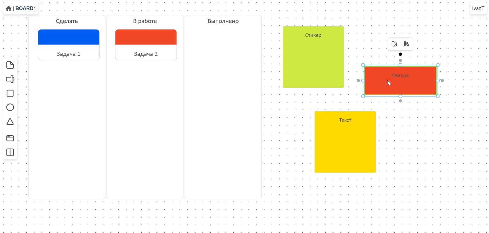

# Онлайн-доска

Веб-приложение, разработанное в рамках выпускной квалификационной работы.

## О приложении

Веб-приложение совмещает в себе гибкость онлайн-досок, таких как Miro, и функционал инструментов для ведения проектов по системе Канбан, например Trello.